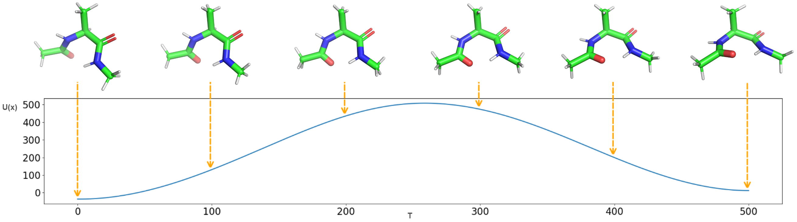

# generalized-flow-matching-for-transition-dynamics-modeling



## Installation

Use the following code to set up the runtime environment, with the required dependencies specified in the `requirements.txt` file.

```bash
conda create --name myenv python=3.11.9
conda activate myenv
pip install -r requirements.txt
```

## Datasets

The Muller-Brown potential data is generated using the `GFM/toy_data/main_2D.py` script.
The alanine dipeptide data is generated using the `GFM_test\src\resample\md_unbiased.py` script.

## Running Experiments

All the hyperparameters corresponding to each training script mentioned in the paper are stored in YAML files located in the same directory. The script uses the `--config_path` flag to specify the YAML configuration file. 
There are four executable files, and their corresponding `--config_path` are as follows:

```bash
python -m GFM.src.train.simultaneous.main_metic_simul.py  --config_path .\GFM\src\train\simultaneous\config_metric.yaml
```
```
python -m GFM.src.train.simultaneous.main_latent_simul.py  --config_path .\GFM\src\train\simultaneous\config_latent.yaml
```
```
python -m GFM.src.train.separate.main_metic_separ.py  --config_path .\GFM\src\train\separate\config_metric.yaml
```
```
python -m GFM.src.train.separate.main_latent_separ.py  --config_path .\GFM\src\train\separate\config_latent.yaml
```

Set `data_on_cluster` to the project directory, i.e., `.\GFM`.

## Evaluation

The data for Muller-Brown potential and alanine dipeptide will be evaluated during the test phase after training is completed. The results will be saved in the `save_address` folder.
